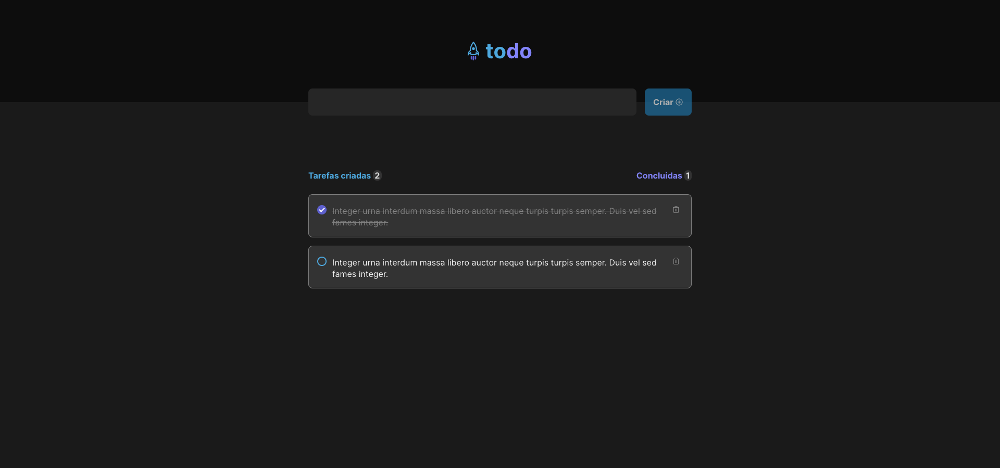

#### Ignite player
Aplicação responsável por gerenciar um simples Todo list, construído com React, Redux e CSS.
Conceitos abordados: componentização, propriedades, estados, imutabilidade e hooks.
## RF

- [x] Adicionar uma nova tarefa 
- [x] Marcar e desmarcar uma tarefa como concluída
- [x] Remover uma tarefa da listagem 
- [x] Mostrar o progresso de conclusão das tarefas

